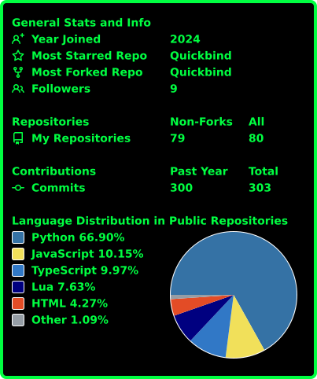

<div align="center">


<br/>


</div>

<br/>

```

┌──(S1D_C0RE㉿sidcore-dev)-[~]
└─$ cat about.md

  name    : (REDACTED)
  alias   : S1D_C0RE
  role    : role.set(false)   // accepting applications from myself
  focus   : building with AI-augmented tooling
  weapon  : Claude Code
  status  : online, mildly caffeinated

```

<br/>

## 🏆 Achievements Unlocked

<div align="center">


-000000?style=for-the-badge&labelColor=000000&color=00FF41)

</div>

<br/>

## ⚡ Loadout

<sub>// tools currently loaded into memory</sub>

<div align="center">


</div>

<br/>

## 📡 Stats Uplink

<sub>// pulling live telemetry, no bots were harmed</sub>

<div align="center">
  
</div>

<div align="center">
  
</div>

<sub>self-hosted via GitHub Actions — see <code>.github/workflows/userstats.yml</code></sub>

<br/>

## 🐍 Contribution Feed

<sub>// tracking every commit like it's classified intel</sub>

<div align="center">
  
</div>

<sub>auto-generated nightly via GitHub Actions — see <code>.github/workflows/snake.yml</code></sub>

<br/>

## 🔗 Comms

```

// links: not deployed yet
// channel status: OFFLINE
// check back soon — building in the meantime
// (this message will not self-destruct, GitHub doesn't support that yet)
// ping me and I might even reply before the next sprint

```

<br/>

<div align="center">
<sub>compiled by S1D_C0RE · last sync: auto · thanks for stopping by, agent 🕶️</sub>
<br/>
<sub><sub>if you're reading this, you scrolled further than most bots do</sub></sub>
</div>
